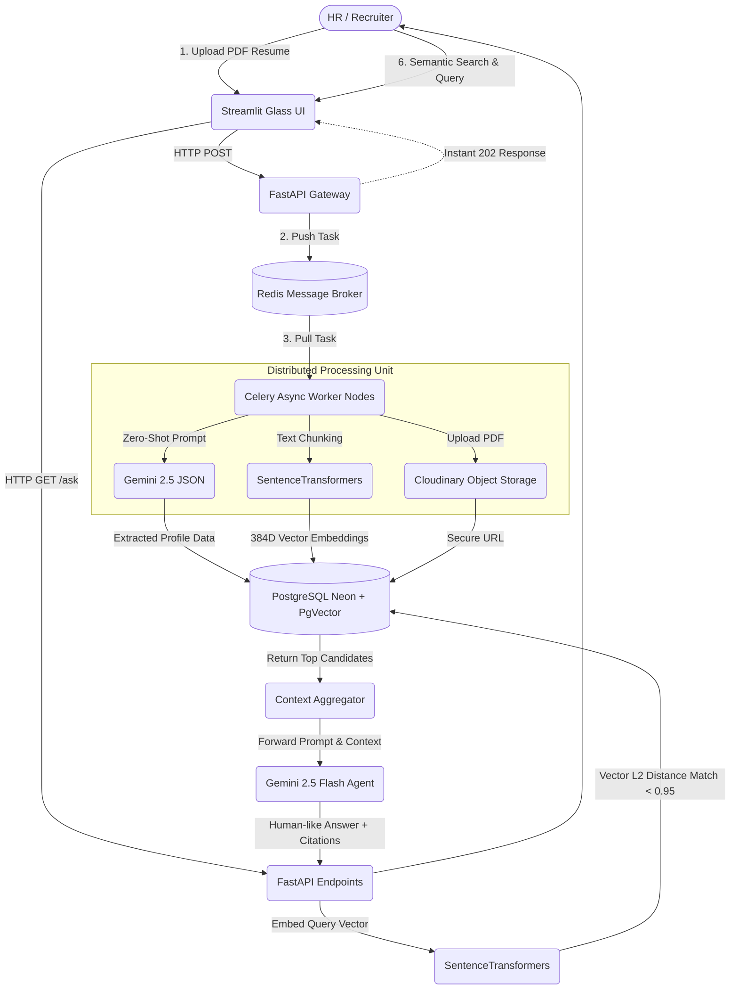

<h1 align="center">
  <br>
  
  
  <br>
  RecruitIQ: Enterprise Resume Intelligence System
</h1>

<p align="center">
  <strong>An Asynchronous, RAG-Powered Applicant Tracking System utilizing LLMs and Vector Search to revolutionize technical recruiting.</strong>
</p>

## ✨ Why This System is Production-Ready & Unique

Most classic AI resume parsers are simple, synchronous scripts that block the server until a document is completely processed. They rely heavily on brittle regular expressions or basic keyword string matching. **RecruitIQ** changes the paradigm:

1. **True Asynchronous Architecture:** It implements a **Celery + Redis distributed task queue**. File uploads are lightning fast, queueing the heavy AI extraction and embedding generation tasks to background worker nodes. This means it can horizontally scale to handle thousands of concurrent resume uploads without ever timing out user UI requests.
2. **Resilient Blob Storage Integration:** Instead of cluttering the application server with generated files, RecruitIQ safely routes parsed files to **Cloudinary object storage**, maintaining web-server statelessness—a core requirement for modern containerized deployments on Kubernetes or AWS ECS.
3. **Structured Data via Generative AI:** Replaces rigid Regex with **Google's Gemini 2.5 Flash** to consistently cast unstructured text into deterministic JSON objects with high accuracy, dynamically parsing even the most chaotic resume formats.
4. **Semantic Vector Search (pgvector):** Built natively around a **RAG (Retrieval-Augmented Generation) Architecture**. Candidate experience is chunked with `all-MiniLM-L6-v2` dense vectors and mapped into a **Neon Serverless Postgres** database using the `pgvector` extension. This enables human-like search queries (e.g., *"Find someone with distributed systems experience"*) instead of relying on exact keyword extraction.
5. **Glassmorphic Interactive UI:** The frontend leverages an advanced, fully customized **Streamlit** dashboard integrating smooth dark mode layouts, beautiful CSS transitions, gradients, and semantic agent interactions.

---

## 🏗 System Architecture 



## 🚀 Core Functionalities

*   **Non-Blocking Ingestion Pipeline:** Uploads rapidly pass securely through the pipeline to a background task queue. The user interacts dynamically with the dashboard while deep semantic tasks execute transparently offline.
*   **Context-Aware Chat:** Integrated Agent HR Assistant resolves highly specific recruiting thresholds smartly while citing real, active candidate profile URLs and information. 
*   **Automatic Dimension Optimization:** Intelligent Postgres setup mechanisms (`fix_db.py`) automatically structure high-efficiency logical vector bounds across relations.
*   **Enterprise UI:** High-fidelity Glassmorphism design built dynamically over Python Webapp layouts offering dynamic hover actions and immersive layouts.

## 🛠 Tech Stack Details

*   **Client Core UI**: Custom Streamlit integration via specific Web Components CSS 
*   **API Gateway**: FastAPI Framework powered by Uvicorn 
*   **Distributed Broker**: Redis Database Space
*   **Async Task Workers**: Celery Nodes
*   **Large Language Models**: Google Gemini 2.5 Flash (`google-genai` SDK)
*   **Natural Language Embeddings**: HuggingFace `sentence-transformers/all-MiniLM-L6-v2`
*   **Persistence & Analytics**: PostgreSQL (Neon.tech Serverless) + pgvector Extension
*   **Cloud Object Storage**: Cloudinary Network SDK

## ⚙️ Quick Start Installation

**1. Clone the core repository**

**2. Isolate virtual environment context**
```bash
python -m venv venv
# On Unix/Mac:
source venv/bin/activate 
# On Windows:
venv\Scripts\activate
```

**3. Inject Project Dependencies**
```bash
pip install -r requirements.txt
```

**4. Register Environment Variables (`.env`)** Add your required configurations (Redis Auth URLs, Neon DB Postgres URL, Google Gemini API, and Cloudinary Secret Identifiers).

**5. Initialize Architecture Embeddings & Tables**
```bash
python setup_db.py
python fix_db.py
```

**6. Spin up Infrastructure Elements**
Launch these components inside isolated terminal sessions mapping back to the same project base:

**Terminal 1:** Redis Message Queue Broker Initialization (Ensure your server host is broadcasting correctly)

**Terminal 2:** API Gateway Orchestrator
```bash
uvicorn main:app --reload
```

**Terminal 3:** Launch Celery Distributed Workers
*(Platform Context: On Windows OS environments, the `--pool=solo` flag ensures no subprocess context limitations occur)*
```bash
celery -A worker.celery_app worker --loglevel=info --pool=solo
```

**Terminal 4:** Bind and Launch Presentation UI
```bash
streamlit run app.py
```

<br>

---

## 🤝 Contributing

Contributions, issues, and feature requests are very welcome! 
Feel free to check out the [Issues page](https://github.com/srikaran3004/RecruitIQ/issues) if you want to contribute or have any ideas on how to improve this project.

<br>
<p align="center">
  <b>Built with ❤️ for the future of recruitment.</b>
</p>
